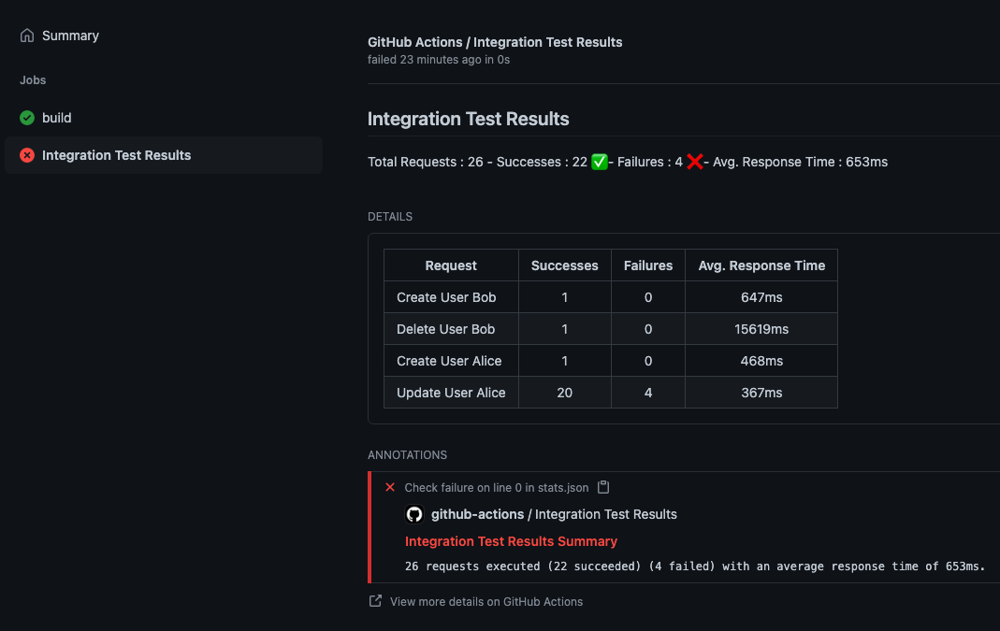

# gatling-annotations

Adds test results action annotations from a gatling stats.json report

## Example

``` yml
- name: annotate test results
  uses: steviemul/gatling-annotations@v1.0
  with:
    name: Integration Test Results
    report-path: reports/usersimulation-*/js
    access-token: ${{ secrets.GITHUB_TOKEN }}
```



## Parameters

- **name**: optional. This will be output in the title and summary of the report. Defaults to 'Gatling Report;
- **report-path**: required. The root folder where stat.json is output too, this can be a glob pattern e.g. **testsimulation-*/js**
- **access-token**: required. It's the github token to allow action to add check e.g. **${{ secrets.GITHUB_TOKEN }}**
